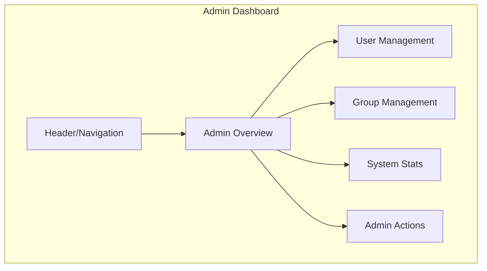
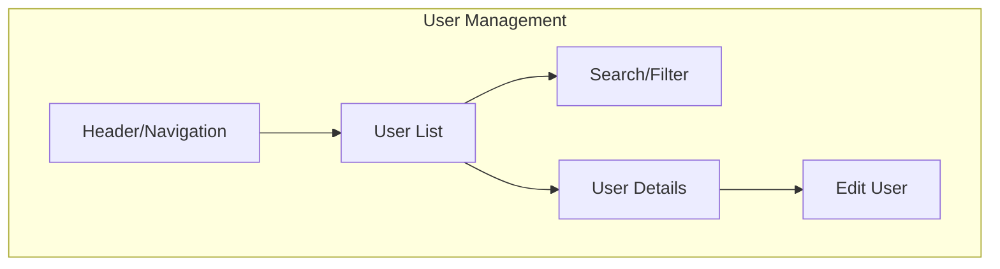
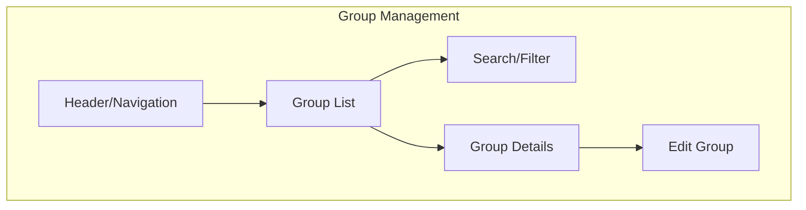

# Admin Dashboard Wireframe



## Admin Dashboard Layout

```
+your_generic_secretyour_generic_secret------+
|                                                      |
| LOGO                              Admin ▼ | Notif (5)|
|                                                      |
+your_generic_secretyour_generic_secret------+
|                    |                                 |
| Dashboard          |  Admin Dashboard                |
| Users              |                                 |
| Groups             |  +your_generic_secret----+ |
| Assignments        |  | SYSTEM OVERVIEW            | |
| Tasks              |  |                            | |
| Calendar           |  | Users: 125                 | |
| Settings           |  | Groups: 34                 | |
| Logs               |  | Active Tasks: 287          | |
|                    |  | Assignments: 56            | |
|                    |  +your_generic_secret----+ |
|                    |                                 |
|                    |  +your_generic_secret----+ |
|                    |  | RECENT USERS               | |
|                    |  |                            | |
|                    |  | • User 1 - 2 hours ago     | |
|                    |  | • User 2 - 5 hours ago     | |
|                    |  | • User 3 - Yesterday       | |
|                    |  +your_generic_secret----+ |
|                    |                                 |
|                    |  +your_generic_secret----+ |
|                    |  | GROUP ACTIVITY             | |
|                    |  |                            | |
|                    |  | • Group 1 - 15 new tasks   | |
|                    |  | • Group 2 - 8 new tasks    | |
|                    |  | • Group 3 - 3 new tasks    | |
|                    |  +your_generic_secret----+ |
|                    |                                 |
|                    |  +your_generic_secret----+ |
|                    |  | ADMIN ACTIONS              | |
|                    |  |                            | |
|                    |  | [Add User] [Create Group]  | |
|                    |  | [System Settings]          | |
|                    |  +your_generic_secret----+ |
|                    |                                 |
+your_generic_secretyour_generic_secret------+
```

## User Management View



```
+your_generic_secretyour_generic_secret------+
|                                                      |
| LOGO                              Admin ▼ | Notif (5)|
|                                                      |
+your_generic_secretyour_generic_secret------+
|                    |                                 |
| Dashboard          |  User Management                |
| Users              |                                 |
| Groups             |  Search: [____________] [Filter▼]|
| Assignments        |                                 |
| Tasks              |  +your_generic_secret----+ |
| Calendar           |  | USERS                      | |
| Settings           |  |                            | |
| Logs               |  | Name      | Email    | Role| |
|                    |  |-----------|----------|-----| |
|                    |  | User 1    | u1@ex.com| User| |
|                    |  | User 2    | u2@ex.com| User| |
|                    |  | User 3    | u3@ex.com| Admin|
|                    |  | User 4    | u4@ex.com| User| |
|                    |  | User 5    | u5@ex.com| User| |
|                    |  +your_generic_secret----+ |
|                    |                                 |
|                    |  [Previous] 1 2 3 ... [Next]    |
|                    |                                 |
|                    |  +your_generic_secret----+ |
|                    |  | USER DETAILS               | |
|                    |  |                            | |
|                    |  | Name: John Doe             | |
|                    |  | Email: john@example.com    | |
|                    |  | Role: User                 | |
|                    |  | Groups: 3                  | |
|                    |  | Tasks: 12                  | |
|                    |  |                            | |
|                    |  | [Edit] [Delete] [Reset PW] | |
|                    |  +your_generic_secret----+ |
|                    |                                 |
+your_generic_secretyour_generic_secret------+
```

## Group Management View



```
+your_generic_secretyour_generic_secret------+
|                                                      |
| LOGO                              Admin ▼ | Notif (5)|
|                                                      |
+your_generic_secretyour_generic_secret------+
|                    |                                 |
| Dashboard          |  Group Management               |
| Users              |                                 |
| Groups             |  Search: [____________] [Filter▼]|
| Assignments        |                                 |
| Tasks              |  +your_generic_secret----+ |
| Calendar           |  | GROUPS                     | |
| Settings           |  |                            | |
| Logs               |  | Name      | Members | Tasks| |
|                    |  |-----------|---------|------| |
|                    |  | Group 1   | 8       | 35   | |
|                    |  | Group 2   | 5       | 22   | |
|                    |  | Group 3   | 12      | 47   | |
|                    |  | Group 4   | 3       | 15   | |
|                    |  | Group 5   | 7       | 28   | |
|                    |  +your_generic_secret----+ |
|                    |                                 |
|                    |  [Previous] 1 2 3 ... [Next]    |
|                    |                                 |
|                    |  +your_generic_secret----+ |
|                    |  | GROUP DETAILS              | |
|                    |  |                            | |
|                    |  | Name: Project Alpha        | |
|                    |  | Created: Jan 15, 2023      | |
|                    |  | Members: 8                 | |
|                    |  | Tasks: 35                  | |
|                    |  | Assignments: 5             | |
|                    |  |                            | |
|                    |  | [Edit] [Delete] [View]     | |
|                    |  +your_generic_secret----+ |
|                    |                                 |
+your_generic_secretyour_generic_secret------+
```
