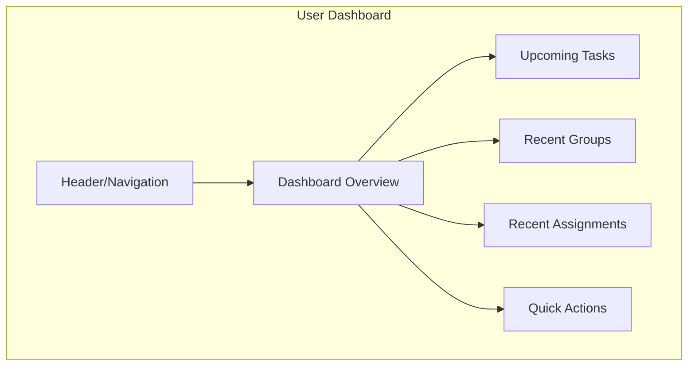
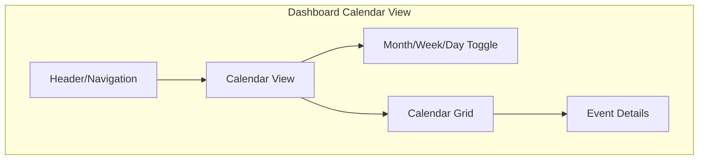
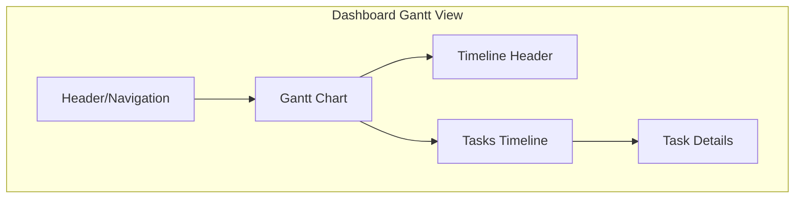

# User Dashboard Wireframe



## User Dashboard Layout

```
+------------------------------------------------------+
|                                                      |
| LOGO                              User ▼ | Notif (3) |
|                                                      |
+------------------------------------------------------+
|                    |                                 |
| Dashboard          |  Welcome back, [User]!          |
| Groups             |                                 |
| Assignments        |  +----------------------------+ |
| Tasks              |  | UPCOMING TASKS             | |
| Calendar           |  |                            | |
| Chat               |  | • Task 1 - Due Tomorrow    | |
| Study Planner      |  | • Task 2 - Due in 2 days   | |
| Pomodoro           |  | • Task 3 - Due in 3 days   | |
| Settings           |  +----------------------------+ |
|                    |                                 |
|                    |  +----------------------------+ |
|                    |  | RECENT GROUPS              | |
|                    |  |                            | |
|                    |  | • Group 1                  | |
|                    |  | • Group 2                  | |
|                    |  | • Group 3                  | |
|                    |  +----------------------------+ |
|                    |                                 |
|                    |  +----------------------------+ |
|                    |  | RECENT ASSIGNMENTS         | |
|                    |  |                            | |
|                    |  | • Assignment 1             | |
|                    |  | • Assignment 2             | |
|                    |  | • Assignment 3             | |
|                    |  +----------------------------+ |
|                    |                                 |
|                    |  +----------------------------+ |
|                    |  | QUICK ACTIONS              | |
|                    |  |                            | |
|                    |  | [Create Task] [Join Group] | |
|                    |  +----------------------------+ |
|                    |                                 |
+------------------------------------------------------+
```

## Dashboard Calendar View



```
+------------------------------------------------------+
|                                                      |
| LOGO                              User ▼ | Notif (3) |
|                                                      |
+------------------------------------------------------+
|                    |                                 |
| Dashboard          |  Calendar                       |
| Groups             |                                 |
| Assignments        |  [Month] [Week] [Day]           |
| Tasks              |                                 |
| Calendar           |  +----------------------------+ |
| Chat               |  | SEPTEMBER 2023             | |
| Study Planner      |  | Mo Tu We Th Fr Sa Su      | |
| Pomodoro           |  | -- -- -- -- 01 02 03      | |
| Settings           |  | 04 05 06 07 08 09 10      | |
|                    |  | 11 12 13 14 15 16 17      | |
|                    |  | 18 19 20 21 22 23 24      | |
|                    |  | 25 26 27 28 29 30 --      | |
|                    |  +----------------------------+ |
|                    |                                 |
|                    |  +----------------------------+ |
|                    |  | TODAY'S EVENTS             | |
|                    |  |                            | |
|                    |  | • 9:00 AM - Team Meeting   | |
|                    |  | • 1:00 PM - Project Review | |
|                    |  | • 3:30 PM - Study Session  | |
|                    |  +----------------------------+ |
|                    |                                 |
|                    |  +----------------------------+ |
|                    |  | UPCOMING DEADLINES         | |
|                    |  |                            | |
|                    |  | • Project A - Sep 15       | |
|                    |  | • Assignment B - Sep 22    | |
|                    |  +----------------------------+ |
|                    |                                 |
+------------------------------------------------------+
```

## Dashboard Gantt View



```
+------------------------------------------------------+
|                                                      |
| LOGO                              User ▼ | Notif (3) |
|                                                      |
+------------------------------------------------------+
|                    |                                 |
| Dashboard          |  Gantt Chart                    |
| Groups             |                                 |
| Assignments        |  [Filter ▼] [Group By ▼]        |
| Tasks              |                                 |
| Calendar           |  +----------------------------+ |
| Chat               |  | TASK     | SEPT | OCT | NOV| |
| Study Planner      |  |----------|------|-----|----| |
| Pomodoro           |  | Task 1   | ====-|     |    | |
| Settings           |  | Task 2   | ===========|    | |
|                    |  | Task 3   |      | ===-|    | |
|                    |  | Task 4   |      |     |====| |
|                    |  | Task 5   | ===========-|    | |
|                    |  +----------------------------+ |
|                    |                                 |
|                    |  +----------------------------+ |
|                    |  | TASK DETAILS               | |
|                    |  |                            | |
|                    |  | Task: Project Phase 1      | |
|                    |  | Start: Sept 5, 2023        | |
|                    |  | End: Oct 15, 2023          | |
|                    |  | Assigned to: John Doe      | |
|                    |  | Progress: 35%              | |
|                    |  +----------------------------+ |
|                    |                                 |
+------------------------------------------------------+
```
