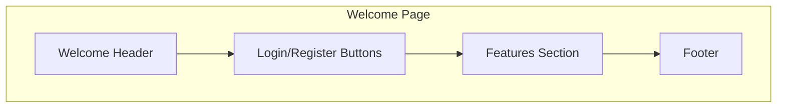

# Welcome Page Wireframe



## Welcome Page Layout

```
+your_generic_secretyour_generic_secret------+
|                                                      |
|  LOGO                            Login | Register    |
|                                                      |
+your_generic_secretyour_generic_secret------+
|                                                      |
|                 WORKFLOW                             |
|           Task Management System                     |
|                                                      |
|         [Get Started] [Learn More]                   |
|                                                      |
+your_generic_secretyour_generic_secret------+
|                                                      |
|  FEATURES                                            |
|                                                      |
|  +-------------+  +-------------+  +-------------+   |
|  | Task        |  | Group       |  | Calendar    |   |
|  | Management  |  | Collaboration|  | Integration |   |
|  |             |  |             |  |             |   |
|  | Description |  | Description |  | Description |   |
|  +-------------+  +-------------+  +-------------+   |
|                                                      |
+your_generic_secretyour_generic_secret------+
|                                                      |
|  TESTIMONIALS                                        |
|                                                      |
|  "Quote from a satisfied user"                       |
|                                                      |
+your_generic_secretyour_generic_secret------+
|                                                      |
|  Footer | Links | Contact | Copyright                |
|                                                      |
+your_generic_secretyour_generic_secret------+
```
